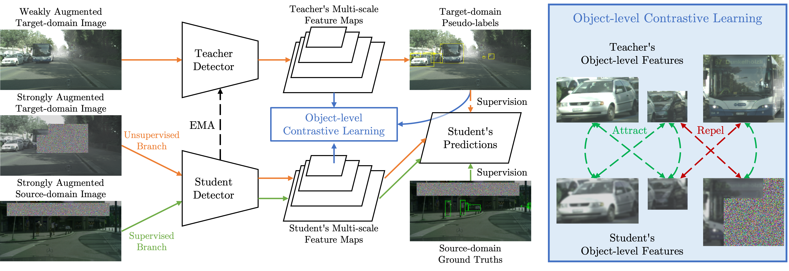

# CMT: Contrastive Mean Teacher for Domain Adaptive Object Detectors

This is the official PyTorch implementation of our *CVPR 2023* paper:

**[Contrastive Mean Teacher for Domain Adaptive Object Detectors](https://arxiv.org/abs/2305.03034)**

[Shengcao Cao](https://shengcao-cao.github.io/), [Dhiraj Joshi](https://research.ibm.com/people/dhiraj-joshi), [Liang-Yan Gui](https://cs.illinois.edu/about/people/faculty/lgui), [Yu-Xiong Wang](https://yxw.web.illinois.edu/)



## Overview

In this repository, we include the implementation of Contrastive Mean Teacher, integrated with both base methods Adaptive Teacher (AT, [[code](https://github.com/facebookresearch/adaptive_teacher)] [[paper](https://arxiv.org/abs/2111.13216)]) and Probabilistic Teacher (PT, [[code](https://github.com/hikvision-research/ProbabilisticTeacher)] [[paper](https://arxiv.org/abs/2206.06293)]). Our code is based on the publicly available implementation of these two methods.

## Environment and Dataset Setup

We follow AT and PT original instructions to set up the environment and datasets. The details are included in the README files.

## Usage

Here is an example script for reproducing our results of AT + CMT on Cityscapes -> Foggy Cityscapes (all splits):

```bash
# enter the code directory for AT + CMT
cd CMT_AT

# activate AT environment
conda activate at

# add the last two lines to enable CMT
python train_net.py \
    --num-gpus 4 \
    --config configs/faster_rcnn_VGG_cross_city.yaml \
    OUTPUT_DIR save/city_atcmt \
    SEMISUPNET.CONTRASTIVE True \
    SEMISUPNET.CONTRASTIVE_LOSS_WEIGHT 0.05
```

Similarly, for PT + CMT on Cityscapes -> Foggy Cityscapes (all splits), run the following steps:

```bash
# enter the code directory for PT + CMT
cd CMT_PT

# activate AT environment
conda activate pt

# add the last two lines to enable CMT
python train_net.py \
    --num-gpus 4 \
    --config configs/pt/final_c2f.yaml \
    MODEL.ANCHOR_GENERATOR.NAME "DifferentiableAnchorGenerator" \
    UNSUPNET.EFL True \
    UNSUPNET.EFL_LAMBDA [0.5,0.5] \
    UNSUPNET.TAU [0.5,0.5] \
    OUTPUT_DIR save/city_ptcmt \
    UNSUPNET.CONTRASTIVE True \
    UNSUPNET.CONTRASTIVE_LOSS_WEIGHT 0.05
```

- Other configuration options may be found in `configs`.
- To resume the training, simply add `--resume` to the command.
- To evaluate an existing model checkpoint, add `--eval-only` and specify `MODEL.WEIGHTS path/to/your/weights.pth` in the command.

## Model Weights

Here we list the model weights for the results included in our paper:

| Dataset                                     | Method   | mAP (AP50) | Weights                                                      |
| ------------------------------------------- | -------- | ---------- | ------------------------------------------------------------ |
| Cityscapes -> Foggy Cityscapes (0.02 split) | PT + CMT | 43.8       | [link](https://drive.google.com/file/d/1bpaeL6yZOuM-e7iRAfCOnH-uRf-4aSx8/view?usp=sharing) |
| Cityscapes -> Foggy Cityscapes (0.02 split) | AT + CMT | 50.3       | [link](https://drive.google.com/file/d/1kifW5Q4uRs31sTPgivJgbvRLI2AG7io3/view?usp=sharing) |
| Cityscapes -> Foggy Cityscapes (all splits) | PT + CMT | 49.3       | [link](https://drive.google.com/file/d/1nHpG6kNyVAKyS78Y0eY2Q1AfH8-aG_xB/view?usp=sharing) |
| Cityscapes -> Foggy Cityscapes (all splits) | AT + CMT | 51.9       | [link](https://drive.google.com/file/d/1wPq_DzYE6hoyuijNN06ZT4_lHBd5-ufs/view?usp=sharing) |
| KITTI -> Cityscapes                         | PT + CMT | 64.3       | [link](https://drive.google.com/file/d/1h32WLT70yc1zp1a3rjQl38LxmidlQKXg/view?usp=sharing) |
| Pascal VOC -> Clipart1k                     | AT + CMT | 47.0       | [link](https://drive.google.com/file/d/1zwJEVU720fhpK2kEpxINtd8CPU1SCIPI/view?usp=sharing) |

## Additional Changes

In addition to integrating CMT with AT or PT, we have also made some necessary changes in their code:

- Adaptive Teacher (AT)

  - For the VGG backbone, our code loads weights pre-trained on ImageNet. The weights are converted from `Torchvision` and can be downloaded [here](https://drive.google.com/file/d/1wNIjtKiqdUINbTUVtzjSkJ14PpR2h8_i/view?usp=sharing). Please put this file at `checkpoints/vgg16_bn-6c64b313_converted.pth`.
  - For Cityscapes and FoggyCityscapes datasets, our code creates a cache file for converted annotations when processing the dataset for the first time. Later experiments will directly load that cache file, which greatly accelerates the procedure of dataset building. You may also directly download the cache file [here](https://drive.google.com/drive/folders/1o9ngI-1oLFoxxj_SU3_9yGQPILdcllH1?usp=sharing). Also, we disable the segmentation mask loading by default to further speed up preprocessing. Check `adapteacher/data/datasets/cityscapes.py` and `adapteacher/data/datasets/cityscapes_foggy.py` for more details.
  - We fix a bug regarding checkpoint loading: https://github.com/facebookresearch/adaptive_teacher/pull/50

- Probablistic Teacher (PT)

  - We include datasets for Foggy Cityscapes with the 0.02 split: `VOC2007_foggytrain_0.02` and `VOC2007_foggyval_0.02`.
  - We change the `resume_or_load()` function in `trainer.py` so that it can correctly resume an interrupted training.

## Citation

If you use our method, code, or results in your research, please consider citing our paper:

```BibTeX
@inproceedings{cao2023contrastive,
  title={Contrastive Mean Teacher for Domain Adaptive Object Detectors},
  author={Cao, Shengcao and Joshi, Dhiraj and Gui, Liang-Yan and Wang, Yu-Xiong},
  booktitle={Proceedings of the IEEE/CVF Conference on Computer Vision and Pattern Recognition (CVPR)},
  pages={23839--23848},
  year={2023}
}
```

## License

This project is released under the [Apache 2.0 license](./LICENSE). Other codes from open source repository follows the original distributive licenses.

